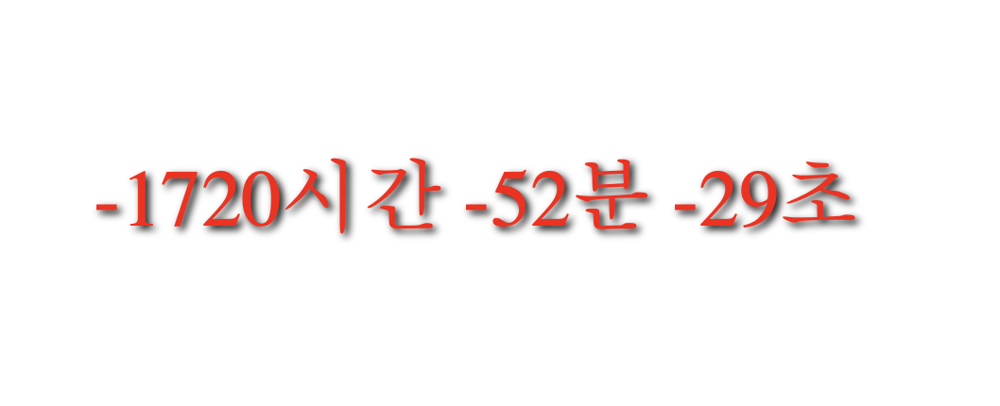
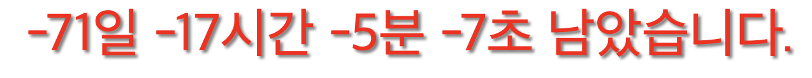

## Question 

HTML과 Javascript  
기능:  
2023.12.31을 기준으로 현재시간을 뺀 남은 시간을 표시한다  
화면:  
중앙에 디지털 시계를 표시한다.  
디지털 시계는 남은 시간을 표시한다.

디지털 시계화면 상세:  
글자크기: 32pt  
그림자 : True  
글자색: 붉은색

소스를 만들어줘

## Answer 

### Chat GPT

```
<!DOCTYPE html>
<html lang="en">
<head>
    <meta charset="UTF-8">
    <meta name="viewport" content="width=device-width, initial-scale=1.0">
    <title>디지털 시계</title>
    <style>
        body {
            display: flex;
            justify-content: center;
            align-items: center;
            height: 100vh;
            margin: 0;
        }

        #digitalClock {
            font-size: 32pt;
            color: red;
            text-shadow: 2px 2px 4px #000;
        }
    </style>
</head>
<body>

<div id="digitalClock"></div>

<script>
    function updateDigitalClock() {
        // 현재 날짜 및 시간 가져오기
        var currentDate = new Date();
        
        // 목표 날짜 및 시간 설정 (2023년 12월 31일)
        var targetDate = new Date('2023-12-31T00:00:00');

        // 남은 시간 계산
        var remainingTime = targetDate - currentDate;

        // 시, 분, 초 계산
        var hours = Math.floor(remainingTime / (1000 * 60 * 60));
        var minutes = Math.floor((remainingTime % (1000 * 60 * 60)) / (1000 * 60));
        var seconds = Math.floor((remainingTime % (1000 * 60)) / 1000);

        // 남은 시간을 디지털 시계에 표시
        var digitalClockElement = document.getElementById('digitalClock');
        digitalClockElement.textContent = `${hours}시간 ${minutes}분 ${seconds}초`;

        // 1초마다 업데이트
        setTimeout(updateDigitalClock, 1000);
    }

    // 초기 호출
    updateDigitalClock();
</script>

</body>
</html>

```


##### OutPut



Web: https://output.jsbin.com/xotiguziwo


### Gemini

#### HTML
```
<!DOCTYPE html>
<html lang="ko">
<head>
  <meta charset="UTF-8">
  <meta name="viewport" content="width=device-width, initial-scale=1.0">
  <title>2023년 12월 31일까지 남은 시간</title>
  <style>
    body {
      font-family: sans-serif;
      text-align: center;
    }
    #clock {
      font-size: 32pt;
      text-shadow: 2px 2px 2px rgba(0, 0, 0, 0.5);
      color: red;
    }
  </style>
</head>
<body>
  <div id="clock"></div>
  <script src="script.js"></script>
</body>
</html>

```


#### JavaScript
```
const targetDate = new Date(2023, 11, 31, 23, 59, 59); // 2023년 12월 31일 23시 59분 59초
const clockElement = document.getElementById("clock");

function updateClock() {
  const now = new Date();
  const diff = targetDate - now;

  const days = Math.floor(diff / (1000 * 60 * 60 * 24));
  const hours = Math.floor((diff % (1000 * 60 * 60 * 24)) / (1000 * 60 * 60));
  const minutes = Math.floor((diff % (1000 * 60 * 60)) / (1000 * 60));
  const seconds = Math.floor((diff % (1000 * 60)) / 1000);

  clockElement.textContent = `${days}일 ${hours}시간 ${minutes}분 ${seconds}초 남았습니다.`;

  // 1초마다 updateClock 함수 실행
  setTimeout(updateClock, 1000);
}

updateClock();

```


##### OutPut


Web: https://output.jsbin.com/mihomaxema/1